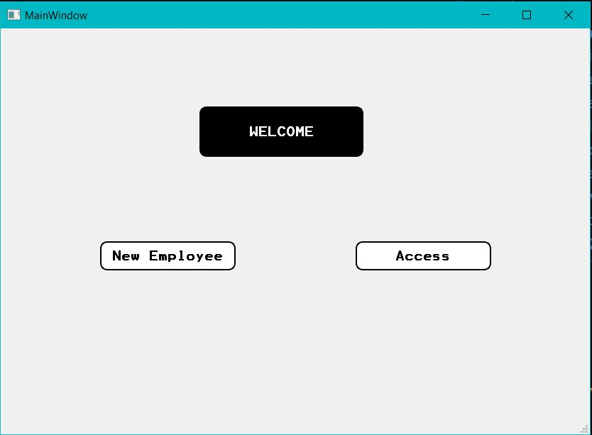
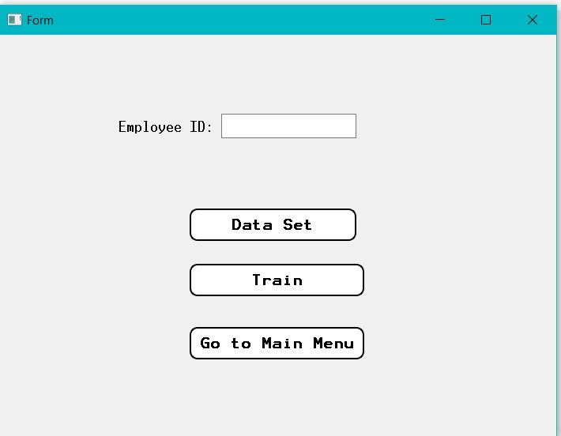
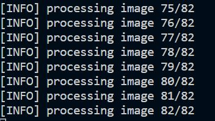

# Face Recognition

A face recognition system which allows user to input their data (images and name). The system can thus detect and recognize their face. This project uses OpenCV for face detection and collects a data set of ~41 pictures of a person. It is trained using pickle module. Finally a face is recognized using face_recognition package in python. This package provides more accuracy than using haarcascades for recognition. The user friendly GUI is made with PyQt5 tools.


## Dependencies

* Python 3.x

* Imutils<br />

* Numpy <br />

* OpenCV<br />

* face_recognition <br /> 

* pickle <br />

* dlib <br />
    Tip: Installing dlib can be a tedious job. On macOS or Linux you may follow [this link](https://gist.github.com/ageitgey/629d75c1baac34dfa5ca2a1928a7aeaf "dlib install")


## Installing

Use the package manager pip to install packages\

Example:
```
pip install imutils 

```

## Procedure
* Clone this repository git clone

```
git@github.com:/siddhipandare/Face-Recognition-.git

```
*  Copy the ```data``` folder from cv2 into a folder.

```
Python\Python38\Lib\site-packages\cv2\data
```


* Make two folders named : ``` dataset ``` and ```encodings```.

* Add the paths of the above folders in the code wherever indicated.
  ```
  path = "Insert the path of the dataset folder"
  ```

* Run MainWindow.py. The Main Window appears.

    

* Click on New Employee if you are using it for the first time. A window as shown below appears.

    

* Type in your Id and click on ```Data Set```.

* Click on ```Train```.

* Once the process of training is done you can see a ```.pickle``` file in the ```encoding``` folder.

    

* Click on ```Go To Main Menu```.

* Click on ```Access``` and see the recognised face label.

* In ```reference files``` folder, you can find individual python codes for ```data```,```train```,```recognition``` and User Interface codes in ```.ui``` files for **Main Window** and **Widget** windows. You can use the following command to convert ```.ui``` to ```.py``` file:

```
pyuic5 -x MainWindow.ui -o MainWindow.py
```

## Authors

* [**Siddhi Pandare**](https://github.com/siddhipandare)


## License

Siddhi Pandare, Veermata Jijabai Technological Institute.

This project is licensed under the [MIT License](LICENSE).


